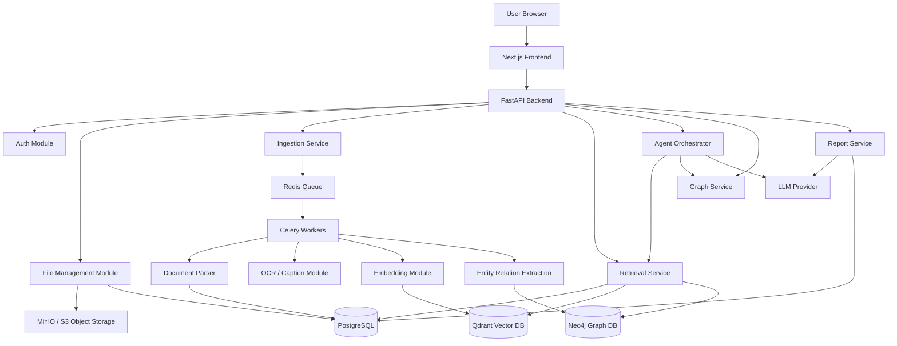
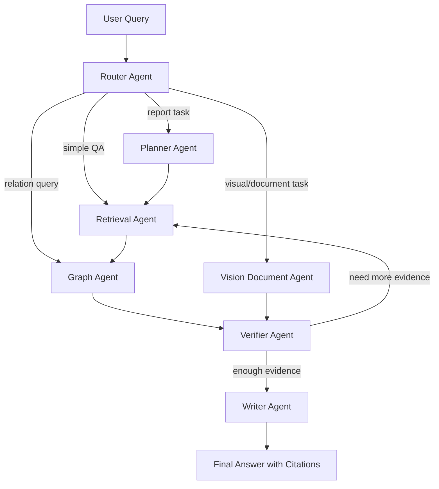
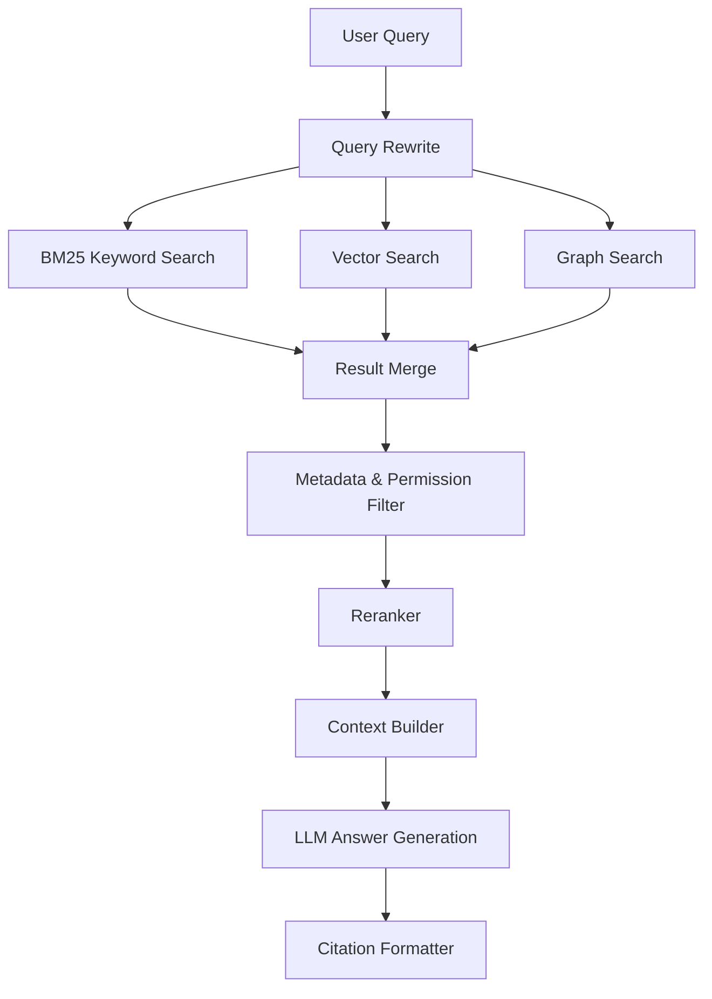
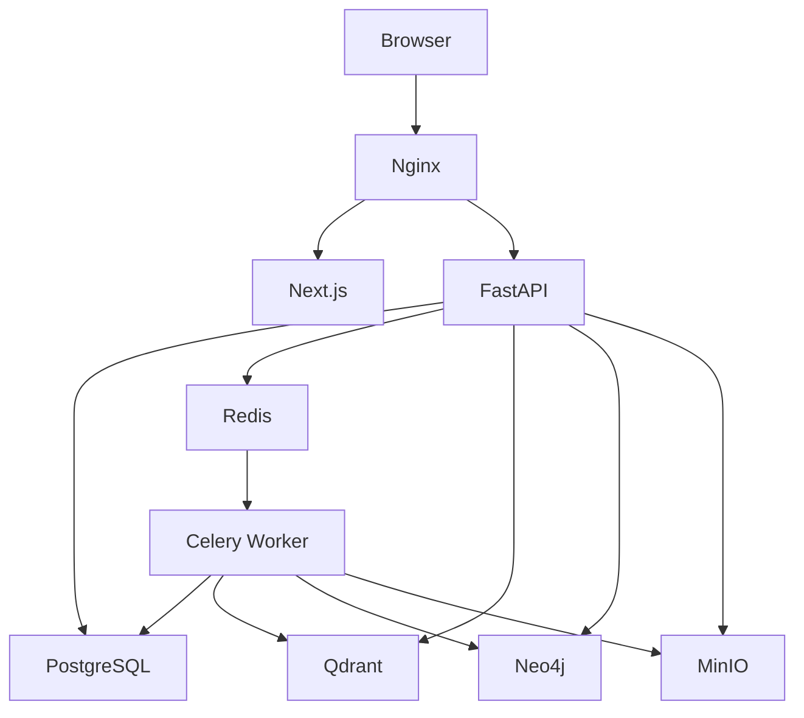
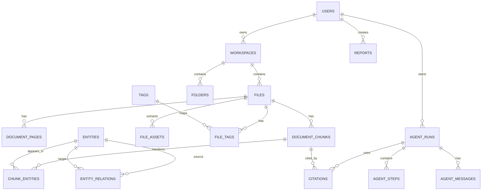

# InsightGraph Agent 设计文档

> 初版设计文档  
> 项目类型：多模态知识库智能体系统  
> 技术方向：AI Agent / RAG / GraphRAG / Multi-Agent / Multimodal Document Retrieval  
> 推荐项目名：**InsightGraph Agent**

---

## 目录

- [0. 项目总览](#0-项目总览)
  - [0.1 项目目标](#01-项目目标)
  - [0.2 项目亮点](#02-项目亮点)
  - [0.3 推荐技术栈](#03-推荐技术栈)
- [1. 产品原型设计文档](#1-产品原型设计文档)
  - [1.1 产品名称](#11-产品名称)
  - [1.2 一句话介绍](#12-一句话介绍)
  - [1.3 目标用户](#13-目标用户)
  - [1.4 核心使用场景](#14-核心使用场景)
  - [1.5 MVP 功能范围](#15-mvp-功能范围)
  - [1.6 页面原型](#16-页面原型)
- [2. 架构设计文档 HLD](#2-架构设计文档-hld)
  - [2.1 总体架构](#21-总体架构)
  - [2.2 系统分层](#22-系统分层)
  - [2.3 模块划分](#23-模块划分)
  - [2.4 Agent Workflow 架构](#24-agent-workflow-架构)
  - [2.5 检索架构](#25-检索架构)
  - [2.6 数据流](#26-数据流)
  - [2.7 部署架构](#27-部署架构)
- [3. 详细设计文档 LLD](#3-详细设计文档-lld)
  - [3.1 后端目录结构](#31-后端目录结构)
  - [3.2 前端目录结构](#32-前端目录结构)
  - [3.3 核心数据结构](#33-核心数据结构)
  - [3.4 主要接口设计](#34-主要接口设计)
  - [3.5 文档解析设计](#35-文档解析设计)
  - [3.6 Chunking 算法](#36-chunking-算法)
  - [3.7 Embedding 设计](#37-embedding-设计)
  - [3.8 Hybrid Retrieval 算法](#38-hybrid-retrieval-算法)
  - [3.9 Graph Extraction 设计](#39-graph-extraction-设计)
  - [3.10 Agent State 设计](#310-agent-state-设计)
  - [3.11 Agent 节点设计](#311-agent-节点设计)
  - [3.12 Agent Workflow 伪代码](#312-agent-workflow-伪代码)
  - [3.13 Citation 设计](#313-citation-设计)
- [4. 数据库设计文档 PDR](#4-数据库设计文档-pdr)
  - [4.1 数据库选型](#41-数据库选型)
  - [4.2 E-R 图](#42-e-r-图)
  - [4.3 PostgreSQL 表结构](#43-postgresql-表结构)
  - [4.4 字典表设计](#44-字典表设计)
  - [4.5 Qdrant 设计](#45-qdrant-设计)
  - [4.6 Neo4j 图谱设计](#46-neo4j-图谱设计)
- [5. API 路由总表](#5-api-路由总表)
- [6. 推荐开发路线](#6-推荐开发路线)
- [7. 简历项目描述](#7-简历项目描述)
- [8. 初版项目命名建议](#8-初版项目命名建议)

---

# 0. 项目总览

## 0.1 项目目标

本项目不是普通的 PDF Chatbot，而是一个 **多模态文件管理 + RAG + GraphRAG + Multi-Agent Workflow** 的知识工作台。

核心目标：

```text
1. 用户可以上传和管理多种文件。
2. 系统自动解析文件内容，包括文本、图片、表格和页面结构。
3. 系统构建向量索引、关键词索引和知识图谱。
4. 用户可以通过自然语言搜索、问答、比较和生成报告。
5. Agent 能够自动规划检索步骤、调用工具、验证答案来源。
6. Web 端展示文件、搜索结果、知识图谱和 Agent 执行过程。
```

## 0.2 项目亮点

适合作品集展示的技术亮点：

```text
1. Multimodal Document Ingestion
   支持 PDF、Word、PPT、图片的统一上传和解析。

2. Hybrid Retrieval
   支持 BM25 keyword search + vector search + metadata filtering + reranking。

3. GraphRAG
   从文档中抽取实体、概念、关系，构建知识图谱，并支持图谱检索。

4. Agentic RAG
   使用 Planner、Retriever、Graph Agent、Verifier、Writer 等角色完成多步问答。

5. Citation Grounding
   回答必须绑定来源文件、页码、chunk、图片或表格。

6. Web Productization
   具备真实产品形态：文件管理、搜索页、知识图谱、Agent 执行轨迹、报告生成。
```

## 0.3 推荐技术栈

```text
Frontend:
- Next.js
- React
- TypeScript
- Tailwind CSS
- shadcn/ui
- React Flow
- PDF.js

Backend:
- Python
- FastAPI
- Pydantic
- SQLAlchemy / SQLModel
- Alembic

Agent Framework:
- LangGraph
- LangChain Tools
- LlamaIndex 可选

AI / Model Layer:
- Gemini API / OpenAI API / Qwen API
- BGE / Jina / OpenAI Embedding
- BGE Reranker / Cohere Rerank / Jina Reranker

Storage:
- PostgreSQL: metadata, users, files, chunks, agent logs
- Qdrant: vector database
- Neo4j: knowledge graph
- MinIO / S3: original files, thumbnails, extracted images
- Redis: cache, queue broker

Async Tasks:
- Celery / RQ / Dramatiq

Deployment:
- Docker
- Docker Compose
- Nginx 可选
```
项目挂载在 wsl环境中, /mnt/d/Develop/multimodalFile
---

# 1. 产品原型设计文档
产品原型图位于D:\Develop\MultimodalFile\insight-graph.zip
## 1.1 产品名称

```text
Multimodal Knowledge Agent
```

中文名：

```text
多模态知识库智能体系统
```

推荐作品集名称：

```text
InsightGraph Agent
```

## 1.2 一句话介绍

英文版：

```text
A multimodal knowledge workspace that turns uploaded documents into a searchable vector index and knowledge graph, then uses AI agents to search, reason, verify, and generate source-grounded answers and reports.
```

中文版：

```text
一个多模态知识工作台，能够将上传的文件转化为可检索的向量索引和知识图谱，并通过智能体完成搜索、推理、验证和报告生成。
```

## 1.3 目标用户

### 主要用户

```text
1. 学生 / 研究员
   管理论文、报告、PPT、实验记录，并进行跨文档问答和总结。

2. 企业知识库使用者
   管理内部文档、会议记录、技术方案、产品文档和项目资料。

3. AI Agent 应用开发展示场景
   用于展示 RAG、GraphRAG、多智能体、Web 工程化能力。
```

## 1.4 核心使用场景

### 场景 1：上传资料并自动构建知识库

用户上传一组 PDF、PPT、Word 文档。系统自动完成：

```text
1. 文件存储
2. 文本提取
3. 图片提取
4. 表格提取
5. OCR
6. 文档切块
7. 向量化
8. 实体关系抽取
9. 知识图谱构建
10. 索引状态更新
```

用户不需要手动整理文档结构。

### 场景 2：语义搜索

用户输入：

```text
Find documents related to GraphRAG and agentic retrieval.
```

系统返回：

```text
1. 相关文件
2. 相关 chunk
3. 相关页面
4. 相似图片或图表
5. 命中的实体和关系
```

搜索结果显示：

```text
- 文件名
- 文件类型
- 页码
- 摘要
- 匹配原因
- 相似度分数
- 来源预览
```

### 场景 3：多文档问答

用户提问：

```text
比较这些文件中关于 RAG 架构设计的不同观点，并给我一个技术选型建议。
```

系统执行：

```text
1. Planner Agent 拆解问题
2. Retrieval Agent 搜索相关文本
3. Graph Agent 查询实体关系
4. Vision Agent 检索 PPT 页面或图片内容
5. Verifier Agent 检查证据是否充分
6. Writer Agent 生成最终答案
```

输出需要包含引用：

```text
According to file A, page 3...
According to file B, chunk 12...
```

### 场景 4：知识图谱探索

用户进入 Knowledge Graph 页面，可以看到：

```text
Document
  → contains Entity
Entity
  → related_to Entity
Entity
  → mentioned_in Chunk
Topic
  → appears_in File
```

用户可以点击某个实体，例如：

```text
GraphRAG
```

系统展示：

```text
1. GraphRAG 出现在哪些文件中
2. 它和 RAG、Knowledge Graph、Entity Extraction 的关系
3. 相关 chunk
4. 相关问答入口
```

### 场景 5：报告生成

用户输入：

```text
基于这些资料生成一份关于 AI Agent 知识库系统的技术方案。
```

系统生成：

```text
1. 背景
2. 系统目标
3. 核心功能
4. 技术架构
5. 模块设计
6. 风险与限制
7. 来源引用
```

报告可以导出为：

```text
Markdown
PDF
Docx 可作为后续扩展
```

## 1.5 MVP 功能范围

初版不要做得过大。MVP 建议如下：

```text
MVP 1:
- 用户登录
- 文件上传
- 文件列表
- PDF / DOCX / PPTX / 图片解析
- 文本 chunking
- embedding
- Qdrant 向量检索
- PostgreSQL metadata 管理
- 基础 RAG 问答
- 来源引用

MVP 2:
- Hybrid search
- reranking
- 知识图谱抽取
- Neo4j 图谱检索
- Agent workflow
- Agent 执行轨迹展示

MVP 3:
- 多模态页面检索
- 图片 caption / OCR
- 知识图谱可视化
- 报告生成
- 权限管理
```

## 1.6 页面原型

### 1.6.1 登录页

```text
Route: /login
```

功能：

```text
- 邮箱登录
- Google 登录可选
- Demo account 可选
```

页面结构：

```text
左侧：产品介绍
右侧：登录表单
```

### 1.6.2 Dashboard 首页

```text
Route: /dashboard
```

展示：

```text
- 文件总数
- 已索引文件数
- chunk 数量
- 实体数量
- 最近上传文件
- 最近 Agent 任务
```

卡片：

```text
1. Total Files
2. Indexed Chunks
3. Knowledge Entities
4. Agent Runs
```

### 1.6.3 文件管理页

```text
Route: /files
```

功能：

```text
- 上传文件
- 文件列表
- 文件夹
- 标签
- 文件类型过滤
- 索引状态显示
- 删除文件
- 重新索引
```

文件状态：

```text
UPLOADED
PARSING
CHUNKING
EMBEDDING
GRAPH_EXTRACTING
INDEXED
FAILED
```

### 1.6.4 文件详情页

```text
Route: /files/[fileId]
```

展示：

```text
- 文件基本信息
- 原文件预览
- 页面缩略图
- 已提取文本
- chunks
- 图片/表格资源
- 相关实体
- 重新索引按钮
```

### 1.6.5 搜索页

```text
Route: /search
```

搜索模式：

```text
1. Keyword Search
2. Semantic Search
3. Hybrid Search
4. Graph Search
5. Multimodal Search
```

筛选条件：

```text
- 文件类型
- 上传时间
- 标签
- 文件夹
- 是否已索引
```

结果卡片：

```text
- 文件名
- 页码
- chunk 摘要
- 匹配分数
- source type: text/image/table/slide
- open preview
```

### 1.6.6 Agent Chat 页面

```text
Route: /agent
```

布局：

```text
左侧：文件/知识库选择
中间：聊天窗口
右侧：Agent execution trace
```

Agent trace 展示：

```text
1. Planning
2. Retrieval
3. Graph Lookup
4. Verification
5. Answer Generation
```

每一步显示：

```text
- agent name
- input
- tool called
- output summary
- latency
- token usage
```

### 1.6.7 Knowledge Graph 页面

```text
Route: /graph
```

使用 React Flow / Cytoscape.js 展示：

```text
- Entity nodes
- Document nodes
- Topic nodes
- Relation edges
```

交互：

```text
- 搜索实体
- 点击节点查看详情
- 展示相关文件
- 从实体发起问答
```

### 1.6.8 Report 页面

```text
Route: /reports
```

功能：

```text
- 输入报告主题
- 选择文件范围
- Agent 自动生成报告
- 编辑 Markdown
- 导出
```

---

# 2. 架构设计文档 HLD

## 2.1 总体架构



## 2.2 系统分层

```text
Presentation Layer
- Next.js Web UI
- 文件管理
- 搜索页面
- Agent Chat
- 知识图谱可视化

Application Layer
- FastAPI
- Auth API
- File API
- Search API
- Agent API
- Report API

Domain Layer
- Document Ingestion
- Chunking
- Embedding
- Hybrid Retrieval
- Graph Extraction
- Agent Workflow

Infrastructure Layer
- PostgreSQL
- Qdrant
- Neo4j
- MinIO
- Redis
- Celery
- LLM API
```

## 2.3 模块划分

### 2.3.1 Auth Module

职责：

```text
- 用户注册
- 用户登录
- JWT token
- workspace 权限
```

MVP 可简化：

```text
- 单用户模式
- Demo login
```

### 2.3.2 File Management Module

职责：

```text
- 文件上传
- 文件删除
- 文件列表
- 文件状态管理
- 文件标签
- 文件夹管理
- 原文件下载
```

核心实体：

```text
File
Folder
Tag
FileTag
```

### 2.3.3 Ingestion Module

职责：

```text
- 判断文件类型
- 调用对应 parser
- 提取文本、图片、表格、页面结构
- 生成 chunks
- 触发 embedding
- 触发 graph extraction
```

支持类型：

```text
PDF
DOCX
PPTX
PNG
JPG
TXT
Markdown
```

### 2.3.4 Embedding Module

职责：

```text
- 文本 embedding
- 图片 caption embedding
- 页面级 embedding
- batch embedding
- embedding 版本管理
```

向量写入：

```text
Qdrant collection:
- document_chunks
- document_pages
- image_assets
```

### 2.3.5 Retrieval Module

职责：

```text
- keyword search
- vector search
- hybrid search
- graph search
- metadata filtering
- reranking
- citation assembly
```

核心流程：

```text
Query
→ Query Normalization
→ Metadata Filter
→ BM25 Search
→ Vector Search
→ Graph Search
→ Merge
→ Rerank
→ Citation Packaging
```

### 2.3.6 Graph Module

职责：

```text
- 从 chunk 中抽取实体
- 抽取关系
- 写入 Neo4j
- 查询实体邻居
- 查询实体相关文档
- 生成 graph context
```

图谱节点：

```text
Document
Chunk
Entity
Topic
User
```

图谱边：

```text
CONTAINS
MENTIONS
RELATED_TO
PART_OF
SIMILAR_TO
```

### 2.3.7 Agent Orchestrator Module

职责：

```text
- 分析用户问题
- 选择工作流
- 调用工具
- 多步检索
- 验证答案
- 生成最终回答
- 记录执行日志
```

Agent 设计：

```text
Router Agent
Planner Agent
Retrieval Agent
Graph Agent
Vision Document Agent
Verifier Agent
Writer Agent
Report Agent
```

推荐使用：

```text
LangGraph
```

因为它适合状态机式 agent workflow。

### 2.3.8 Report Module

职责：

```text
- 根据用户主题生成报告
- 引用来源
- 输出 Markdown
- 保存报告
- 后续支持 PDF / DOCX 导出
```

## 2.4 Agent Workflow 架构



## 2.5 检索架构



## 2.6 数据流

### 文件上传数据流

```text
1. User uploads file from frontend.
2. Backend saves metadata into PostgreSQL.
3. Backend uploads raw file into MinIO.
4. Backend creates ingestion task.
5. Worker parses file.
6. Worker extracts text/images/tables.
7. Worker creates chunks.
8. Worker generates embeddings.
9. Worker stores vectors in Qdrant.
10. Worker extracts entities and relations.
11. Worker writes graph into Neo4j.
12. File status becomes INDEXED.
```

### 问答数据流

```text
1. User sends query.
2. Router Agent classifies task.
3. Planner Agent creates search plan.
4. Retrieval Agent searches chunks.
5. Graph Agent retrieves relations.
6. Verifier checks evidence sufficiency.
7. Writer generates answer.
8. Backend stores agent run and messages.
9. Frontend displays answer and execution trace.
```

## 2.7 部署架构



Docker Compose 服务：

```text
frontend
backend
worker
postgres
redis
qdrant
neo4j
minio
```

---

# 3. 详细设计文档 LLD

## 3.1 后端目录结构

```text
backend/
├─ app/
│  ├─ main.py
│  ├─ core/
│  │  ├─ config.py
│  │  ├─ security.py
│  │  ├─ logging.py
│  │  └─ exceptions.py
│  │
│  ├─ api/
│  │  ├─ deps.py
│  │  └─ v1/
│  │     ├─ auth.py
│  │     ├─ files.py
│  │     ├─ search.py
│  │     ├─ agent.py
│  │     ├─ graph.py
│  │     └─ reports.py
│  │
│  ├─ models/
│  │  ├─ user.py
│  │  ├─ file.py
│  │  ├─ chunk.py
│  │  ├─ asset.py
│  │  ├─ agent.py
│  │  └─ report.py
│  │
│  ├─ schemas/
│  │  ├─ file.py
│  │  ├─ search.py
│  │  ├─ agent.py
│  │  └─ report.py
│  │
│  ├─ services/
│  │  ├─ file_service.py
│  │  ├─ ingestion_service.py
│  │  ├─ chunking_service.py
│  │  ├─ embedding_service.py
│  │  ├─ retrieval_service.py
│  │  ├─ graph_service.py
│  │  ├─ agent_service.py
│  │  └─ report_service.py
│  │
│  ├─ parsers/
│  │  ├─ base.py
│  │  ├─ pdf_parser.py
│  │  ├─ docx_parser.py
│  │  ├─ pptx_parser.py
│  │  └─ image_parser.py
│  │
│  ├─ agents/
│  │  ├─ state.py
│  │  ├─ graph.py
│  │  ├─ router_agent.py
│  │  ├─ planner_agent.py
│  │  ├─ retrieval_agent.py
│  │  ├─ graph_agent.py
│  │  ├─ verifier_agent.py
│  │  └─ writer_agent.py
│  │
│  ├─ tools/
│  │  ├─ vector_search_tool.py
│  │  ├─ graph_search_tool.py
│  │  ├─ file_lookup_tool.py
│  │  └─ citation_tool.py
│  │
│  ├─ db/
│  │  ├─ session.py
│  │  ├─ base.py
│  │  └─ migrations/
│  │
│  ├─ workers/
│  │  ├─ celery_app.py
│  │  └─ tasks.py
│  │
│  └─ integrations/
│     ├─ qdrant_client.py
│     ├─ neo4j_client.py
│     ├─ minio_client.py
│     └─ llm_client.py
│
├─ tests/
├─ alembic/
├─ pyproject.toml
└─ Dockerfile
```

## 3.2 前端目录结构

```text
frontend/
├─ app/
│  ├─ layout.tsx
│  ├─ page.tsx
│  ├─ login/
│  ├─ dashboard/
│  ├─ files/
│  │  ├─ page.tsx
│  │  └─ [fileId]/page.tsx
│  ├─ search/page.tsx
│  ├─ agent/page.tsx
│  ├─ graph/page.tsx
│  └─ reports/page.tsx
│
├─ components/
│  ├─ layout/
│  │  ├─ AppShell.tsx
│  │  ├─ Sidebar.tsx
│  │  └─ Topbar.tsx
│  ├─ files/
│  │  ├─ FileUpload.tsx
│  │  ├─ FileTable.tsx
│  │  ├─ FilePreview.tsx
│  │  └─ ChunkList.tsx
│  ├─ search/
│  │  ├─ SearchBar.tsx
│  │  ├─ SearchFilters.tsx
│  │  └─ SearchResultCard.tsx
│  ├─ agent/
│  │  ├─ AgentChat.tsx
│  │  ├─ AgentTracePanel.tsx
│  │  └─ CitationList.tsx
│  ├─ graph/
│  │  ├─ KnowledgeGraph.tsx
│  │  └─ EntityPanel.tsx
│  └─ reports/
│     ├─ ReportEditor.tsx
│     └─ ReportGenerator.tsx
│
├─ lib/
│  ├─ api.ts
│  ├─ types.ts
│  └─ utils.ts
│
└─ package.json
```

## 3.3 核心数据结构

### 3.3.1 FileStatus

```python
from enum import Enum

class FileStatus(str, Enum):
    UPLOADED = "uploaded"
    PARSING = "parsing"
    CHUNKING = "chunking"
    EMBEDDING = "embedding"
    GRAPH_EXTRACTING = "graph_extracting"
    INDEXED = "indexed"
    FAILED = "failed"
```

### 3.3.2 Modality

```python
class Modality(str, Enum):
    TEXT = "text"
    IMAGE = "image"
    TABLE = "table"
    PAGE = "page"
    VIDEO_FRAME = "video_frame"
    AUDIO = "audio"
```

### 3.3.3 SearchMode

```python
class SearchMode(str, Enum):
    KEYWORD = "keyword"
    VECTOR = "vector"
    HYBRID = "hybrid"
    GRAPH = "graph"
    MULTIMODAL = "multimodal"
```

## 3.4 主要接口设计

### 3.4.1 文件上传接口

```http
POST /api/v1/files/upload
Content-Type: multipart/form-data
```

Request:

```text
file: binary
folder_id?: uuid
tags?: string[]
```

Response:

```json
{
  "file_id": "uuid",
  "filename": "paper.pdf",
  "status": "uploaded",
  "message": "File uploaded successfully. Indexing task created."
}
```

后端逻辑：

```text
1. 校验文件类型和大小。
2. 创建 file record。
3. 上传原文件到 MinIO。
4. 创建 ingestion job。
5. 返回 file_id。
```

### 3.4.2 文件列表接口

```http
GET /api/v1/files
```

Query params:

```text
folder_id?
file_type?
status?
keyword?
page?
page_size?
```

Response:

```json
{
  "items": [
    {
      "id": "uuid",
      "filename": "paper.pdf",
      "file_type": "pdf",
      "status": "indexed",
      "created_at": "2026-05-15T10:00:00Z",
      "chunk_count": 42,
      "entity_count": 15
    }
  ],
  "total": 1
}
```

### 3.4.3 搜索接口

```http
POST /api/v1/search
```

Request:

```json
{
  "query": "GraphRAG and multi-agent retrieval",
  "mode": "hybrid",
  "filters": {
    "file_types": ["pdf", "pptx"],
    "folder_ids": [],
    "tag_ids": [],
    "date_from": null,
    "date_to": null
  },
  "top_k": 10
}
```

Response:

```json
{
  "query": "GraphRAG and multi-agent retrieval",
  "results": [
    {
      "chunk_id": "uuid",
      "file_id": "uuid",
      "filename": "graphrag.pdf",
      "page_number": 3,
      "modality": "text",
      "snippet": "GraphRAG constructs an entity graph...",
      "score": 0.87,
      "source": {
        "file_id": "uuid",
        "page_number": 3,
        "bbox": null
      }
    }
  ]
}
```

### 3.4.4 Agent 问答接口

```http
POST /api/v1/agent/runs
```

Request:

```json
{
  "query": "Compare the RAG designs in these files and generate a technical recommendation.",
  "workspace_id": "uuid",
  "file_ids": ["uuid1", "uuid2"],
  "options": {
    "enable_graph": true,
    "enable_multimodal": true,
    "require_citations": true
  }
}
```

Response:

```json
{
  "run_id": "uuid",
  "status": "running"
}
```

WebSocket:

```http
GET /api/v1/agent/runs/{run_id}/stream
```

Streaming event:

```json
{
  "step": "retrieval_agent",
  "status": "completed",
  "message": "Retrieved 12 relevant chunks.",
  "tool_calls": [
    {
      "tool": "vector_search",
      "latency_ms": 430
    }
  ]
}
```

Final result:

```json
{
  "answer": "The files suggest three main RAG design patterns...",
  "citations": [
    {
      "file_id": "uuid",
      "filename": "paper.pdf",
      "page_number": 5,
      "chunk_id": "uuid"
    }
  ]
}
```

### 3.4.5 图谱查询接口

```http
GET /api/v1/graph/entities/{entity_id}
```

Response:

```json
{
  "entity": {
    "id": "uuid",
    "name": "GraphRAG",
    "type": "TECH_CONCEPT"
  },
  "neighbors": [
    {
      "id": "uuid",
      "name": "Knowledge Graph",
      "relation": "RELATED_TO"
    }
  ],
  "documents": [
    {
      "file_id": "uuid",
      "filename": "graphrag.pdf"
    }
  ]
}
```

## 3.5 文档解析设计

### 3.5.1 Parser 抽象类

```python
from abc import ABC, abstractmethod

class BaseParser(ABC):
    @abstractmethod
    def parse(self, file_path: str) -> "ParsedDocument":
        pass
```

### 3.5.2 ParsedDocument

```python
from pydantic import BaseModel
from typing import List, Optional

class ParsedPage(BaseModel):
    page_number: int
    text: str
    images: list["ExtractedImage"] = []
    tables: list["ExtractedTable"] = []

class ParsedDocument(BaseModel):
    file_id: str
    title: Optional[str]
    pages: List[ParsedPage]
    metadata: dict = {}
```

### 3.5.3 ExtractedImage

```python
from pydantic import BaseModel
from typing import Optional

class ExtractedImage(BaseModel):
    image_path: str
    page_number: int
    bbox: Optional[dict] = None
    caption: Optional[str] = None
    ocr_text: Optional[str] = None
```

### 3.5.4 ExtractedTable

```python
from pydantic import BaseModel
from typing import Optional

class ExtractedTable(BaseModel):
    page_number: int
    table_markdown: str
    bbox: Optional[dict] = None
```

## 3.6 Chunking 算法

### 3.6.1 基础文本切块策略

```text
Input:
- parsed pages

Process:
1. 按页面读取文本。
2. 清理空行、页眉页脚。
3. 按标题或段落切分。
4. 如果 chunk 太长，按 token window 切分。
5. 添加 overlap。
6. 保存 page_number、section_title、offset 信息。

Output:
- document chunks
```

建议参数：

```text
chunk_size: 800 tokens
chunk_overlap: 120 tokens
min_chunk_size: 100 tokens
```

### 3.6.2 Chunk 数据结构

```python
from pydantic import BaseModel

class DocumentChunk(BaseModel):
    id: str
    file_id: str
    page_number: int | None
    chunk_index: int
    modality: str
    content: str
    token_count: int
    metadata: dict
```

## 3.7 Embedding 设计

### 3.7.1 EmbeddingService

```python
class EmbeddingService:
    def embed_texts(self, texts: list[str]) -> list[list[float]]:
        pass

    def embed_query(self, query: str) -> list[float]:
        pass

    def embed_image_caption(self, caption: str) -> list[float]:
        pass
```

### 3.7.2 Qdrant Collection

```text
collection: document_chunks

vector:
- size: depends on embedding model
- distance: cosine

payload:
- chunk_id
- file_id
- workspace_id
- page_number
- modality
- filename
- tags
- created_at
```

## 3.8 Hybrid Retrieval 算法

### 3.8.1 Search Pipeline

```python
class RetrievalService:
    def search(self, query: str, mode: SearchMode, filters: SearchFilters, top_k: int):
        rewritten_query = self.query_rewrite(query)

        keyword_results = []
        vector_results = []
        graph_results = []

        if mode in ["keyword", "hybrid"]:
            keyword_results = self.keyword_search(rewritten_query, filters, top_k)

        if mode in ["vector", "hybrid", "multimodal"]:
            vector_results = self.vector_search(rewritten_query, filters, top_k)

        if mode in ["graph", "hybrid"]:
            graph_results = self.graph_search(rewritten_query, filters, top_k)

        merged = self.merge_results(keyword_results, vector_results, graph_results)
        reranked = self.rerank(query, merged)
        return self.build_citations(reranked)
```

### 3.8.2 结果融合策略

可以使用 Reciprocal Rank Fusion：

```text
score(d) = Σ 1 / (k + rank_i(d))
```

建议：

```text
k = 60
```

融合来源：

```text
BM25 results
Vector results
Graph-related chunk results
```

### 3.8.3 Rerank

Reranker 输入：

```text
query
chunk content
metadata
```

输出：

```text
relevance_score
```

最终排序：

```text
final_score = 0.6 * rerank_score + 0.25 * vector_score + 0.15 * keyword_score
```

## 3.9 Graph Extraction 设计

### 3.9.1 Entity Types

```text
PERSON
ORGANIZATION
PROJECT
TECH_CONCEPT
METHOD
DATASET
MODEL
TOOL
PAPER
TASK
DATE
LOCATION
```

### 3.9.2 Relation Types

```text
RELATED_TO
PART_OF
USES
PROPOSES
MENTIONS
COMPARES_WITH
DEPENDS_ON
EVALUATED_BY
IMPLEMENTED_IN
```

### 3.9.3 抽取流程

```text
Input:
- chunk text

Process:
1. LLM / NER model 抽取 entities。
2. LLM 抽取 relation triples。
3. 进行 entity normalization。
4. 合并重复实体。
5. 写入 PostgreSQL entity tables。
6. 写入 Neo4j graph。
```

### 3.9.4 Triple 数据结构

```python
from pydantic import BaseModel

class ExtractedTriple(BaseModel):
    subject: str
    subject_type: str
    relation: str
    object: str
    object_type: str
    confidence: float
    evidence_chunk_id: str
```

## 3.10 Agent State 设计

```python
from typing import TypedDict, Optional

class AgentState(TypedDict):
    run_id: str
    user_query: str
    rewritten_query: Optional[str]
    task_type: Optional[str]
    plan: list[str]
    retrieved_chunks: list[dict]
    graph_context: list[dict]
    visual_context: list[dict]
    citations: list[dict]
    verification_result: Optional[dict]
    final_answer: Optional[str]
    errors: list[str]
```

## 3.11 Agent 节点设计

### Router Agent

输入：

```text
user_query
```

输出：

```text
task_type:
- simple_qa
- document_search
- comparison
- report_generation
- graph_exploration
- visual_document_qa
```

### Planner Agent

输入：

```text
user_query
task_type
```

输出：

```json
{
  "steps": [
    "Search relevant chunks",
    "Retrieve graph relations",
    "Compare evidence",
    "Generate answer with citations"
  ]
}
```

### Retrieval Agent

职责：

```text
- 调用 hybrid search
- 返回 chunks
- 记录检索分数
```

### Graph Agent

职责：

```text
- 识别 query 中的实体
- 查询 Neo4j
- 找相关实体、关系和文档
```

### Vision Document Agent

职责：

```text
- 查询图片 caption
- 查询 OCR 文本
- 查询页面截图
- 返回图文证据
```

### Verifier Agent

职责：

```text
- 检查答案是否有足够 citation
- 检查是否存在 unsupported claims
- 决定是否需要二次检索
```

输出：

```json
{
  "is_sufficient": true,
  "missing_evidence": [],
  "needs_retry": false
}
```

### Writer Agent

职责：

```text
- 基于 verified evidence 生成最终回答
- 格式化 citation
- 输出 markdown
```

## 3.12 Agent Workflow 伪代码

```python
def run_agent_workflow(query: str, options: dict):
    state = init_state(query)

    state = router_agent(state)

    if state["task_type"] in ["comparison", "report_generation"]:
        state = planner_agent(state)

    state = retrieval_agent(state)

    if options.get("enable_graph"):
        state = graph_agent(state)

    if options.get("enable_multimodal"):
        state = vision_document_agent(state)

    state = verifier_agent(state)

    if state["verification_result"]["needs_retry"]:
        state = retrieval_agent(state)
        state = verifier_agent(state)

    state = writer_agent(state)

    save_agent_run(state)

    return state["final_answer"]
```

## 3.13 Citation 设计

Citation 对象：

```python
from pydantic import BaseModel

class Citation(BaseModel):
    file_id: str
    filename: str
    chunk_id: str | None
    page_number: int | None
    asset_id: str | None
    quote: str | None
    relevance_score: float
```

回答格式：

```text
The document suggests that GraphRAG improves global knowledge organization by constructing entity relationships. [Source: graphrag.pdf, p. 5]
```

---

# 4. 数据库设计文档 PDR

## 4.1 数据库选型

```text
PostgreSQL:
- 用户
- 文件 metadata
- chunk metadata
- agent logs
- report records
- entity records

Qdrant:
- chunk embedding
- page embedding
- image caption embedding

Neo4j:
- entity graph
- document graph
- relation graph

MinIO:
- raw files
- preview images
- extracted images
- report exports
```

## 4.2 E-R 图



## 4.3 PostgreSQL 表结构

### 4.3.1 users

```sql
CREATE TABLE users (
    id UUID PRIMARY KEY,
    email VARCHAR(255) UNIQUE NOT NULL,
    display_name VARCHAR(255),
    password_hash TEXT,
    role VARCHAR(50) NOT NULL DEFAULT 'user',
    created_at TIMESTAMP NOT NULL DEFAULT now(),
    updated_at TIMESTAMP NOT NULL DEFAULT now()
);
```

索引：

```sql
CREATE UNIQUE INDEX idx_users_email ON users(email);
```

### 4.3.2 workspaces

```sql
CREATE TABLE workspaces (
    id UUID PRIMARY KEY,
    owner_id UUID NOT NULL REFERENCES users(id),
    name VARCHAR(255) NOT NULL,
    description TEXT,
    created_at TIMESTAMP NOT NULL DEFAULT now(),
    updated_at TIMESTAMP NOT NULL DEFAULT now()
);
```

索引：

```sql
CREATE INDEX idx_workspaces_owner_id ON workspaces(owner_id);
```

### 4.3.3 folders

```sql
CREATE TABLE folders (
    id UUID PRIMARY KEY,
    workspace_id UUID NOT NULL REFERENCES workspaces(id),
    parent_id UUID REFERENCES folders(id),
    name VARCHAR(255) NOT NULL,
    created_at TIMESTAMP NOT NULL DEFAULT now()
);
```

索引：

```sql
CREATE INDEX idx_folders_workspace_id ON folders(workspace_id);
CREATE INDEX idx_folders_parent_id ON folders(parent_id);
```

### 4.3.4 files

```sql
CREATE TABLE files (
    id UUID PRIMARY KEY,
    workspace_id UUID NOT NULL REFERENCES workspaces(id),
    folder_id UUID REFERENCES folders(id),
    uploader_id UUID NOT NULL REFERENCES users(id),

    original_filename VARCHAR(512) NOT NULL,
    stored_filename VARCHAR(512) NOT NULL,
    file_type VARCHAR(50) NOT NULL,
    mime_type VARCHAR(255),
    file_size BIGINT NOT NULL,

    storage_bucket VARCHAR(255) NOT NULL,
    storage_key TEXT NOT NULL,

    status VARCHAR(50) NOT NULL DEFAULT 'uploaded',
    error_message TEXT,

    page_count INTEGER DEFAULT 0,
    chunk_count INTEGER DEFAULT 0,
    asset_count INTEGER DEFAULT 0,
    entity_count INTEGER DEFAULT 0,

    created_at TIMESTAMP NOT NULL DEFAULT now(),
    updated_at TIMESTAMP NOT NULL DEFAULT now()
);
```

索引：

```sql
CREATE INDEX idx_files_workspace_id ON files(workspace_id);
CREATE INDEX idx_files_folder_id ON files(folder_id);
CREATE INDEX idx_files_status ON files(status);
CREATE INDEX idx_files_file_type ON files(file_type);
CREATE INDEX idx_files_created_at ON files(created_at);
```

### 4.3.5 document_pages

```sql
CREATE TABLE document_pages (
    id UUID PRIMARY KEY,
    file_id UUID NOT NULL REFERENCES files(id) ON DELETE CASCADE,
    page_number INTEGER NOT NULL,
    text_content TEXT,
    preview_image_key TEXT,
    width FLOAT,
    height FLOAT,
    metadata JSONB DEFAULT '{}'::jsonb,
    created_at TIMESTAMP NOT NULL DEFAULT now()
);
```

索引：

```sql
CREATE INDEX idx_document_pages_file_id ON document_pages(file_id);
CREATE UNIQUE INDEX idx_document_pages_file_page ON document_pages(file_id, page_number);
```

### 4.3.6 document_chunks

```sql
CREATE TABLE document_chunks (
    id UUID PRIMARY KEY,
    file_id UUID NOT NULL REFERENCES files(id) ON DELETE CASCADE,
    page_id UUID REFERENCES document_pages(id) ON DELETE SET NULL,

    chunk_index INTEGER NOT NULL,
    modality VARCHAR(50) NOT NULL DEFAULT 'text',

    content TEXT NOT NULL,
    content_hash VARCHAR(128),
    token_count INTEGER DEFAULT 0,

    page_number INTEGER,
    section_title TEXT,
    bbox JSONB,

    embedding_collection VARCHAR(255),
    embedding_point_id VARCHAR(255),
    embedding_model VARCHAR(255),

    metadata JSONB DEFAULT '{}'::jsonb,

    created_at TIMESTAMP NOT NULL DEFAULT now()
);
```

索引：

```sql
CREATE INDEX idx_chunks_file_id ON document_chunks(file_id);
CREATE INDEX idx_chunks_page_id ON document_chunks(page_id);
CREATE INDEX idx_chunks_modality ON document_chunks(modality);
CREATE INDEX idx_chunks_file_chunk_index ON document_chunks(file_id, chunk_index);
CREATE INDEX idx_chunks_content_hash ON document_chunks(content_hash);
CREATE INDEX idx_chunks_metadata_gin ON document_chunks USING GIN(metadata);
```

全文索引：

```sql
CREATE INDEX idx_chunks_fts
ON document_chunks
USING GIN(to_tsvector('english', content));
```

### 4.3.7 file_assets

用于保存从文档中提取出的图片、表格、页面截图等。

```sql
CREATE TABLE file_assets (
    id UUID PRIMARY KEY,
    file_id UUID NOT NULL REFERENCES files(id) ON DELETE CASCADE,
    page_id UUID REFERENCES document_pages(id) ON DELETE SET NULL,

    asset_type VARCHAR(50) NOT NULL,
    storage_bucket VARCHAR(255),
    storage_key TEXT,

    page_number INTEGER,
    bbox JSONB,

    ocr_text TEXT,
    caption TEXT,
    table_markdown TEXT,

    embedding_collection VARCHAR(255),
    embedding_point_id VARCHAR(255),

    metadata JSONB DEFAULT '{}'::jsonb,
    created_at TIMESTAMP NOT NULL DEFAULT now()
);
```

asset_type 字典：

```text
image
table
page_preview
chart
formula
```

索引：

```sql
CREATE INDEX idx_assets_file_id ON file_assets(file_id);
CREATE INDEX idx_assets_page_id ON file_assets(page_id);
CREATE INDEX idx_assets_asset_type ON file_assets(asset_type);
```

### 4.3.8 tags

```sql
CREATE TABLE tags (
    id UUID PRIMARY KEY,
    workspace_id UUID NOT NULL REFERENCES workspaces(id),
    name VARCHAR(100) NOT NULL,
    color VARCHAR(50),
    created_at TIMESTAMP NOT NULL DEFAULT now()
);
```

索引：

```sql
CREATE UNIQUE INDEX idx_tags_workspace_name ON tags(workspace_id, name);
```

### 4.3.9 file_tags

```sql
CREATE TABLE file_tags (
    file_id UUID NOT NULL REFERENCES files(id) ON DELETE CASCADE,
    tag_id UUID NOT NULL REFERENCES tags(id) ON DELETE CASCADE,
    PRIMARY KEY (file_id, tag_id)
);
```

索引：

```sql
CREATE INDEX idx_file_tags_tag_id ON file_tags(tag_id);
```

### 4.3.10 entities

```sql
CREATE TABLE entities (
    id UUID PRIMARY KEY,
    workspace_id UUID NOT NULL REFERENCES workspaces(id),

    name VARCHAR(512) NOT NULL,
    normalized_name VARCHAR(512) NOT NULL,
    entity_type VARCHAR(100) NOT NULL,

    description TEXT,
    confidence FLOAT DEFAULT 0.0,

    metadata JSONB DEFAULT '{}'::jsonb,

    created_at TIMESTAMP NOT NULL DEFAULT now(),
    updated_at TIMESTAMP NOT NULL DEFAULT now()
);
```

索引：

```sql
CREATE INDEX idx_entities_workspace_id ON entities(workspace_id);
CREATE INDEX idx_entities_type ON entities(entity_type);
CREATE INDEX idx_entities_normalized_name ON entities(normalized_name);
CREATE UNIQUE INDEX idx_entities_workspace_normalized
ON entities(workspace_id, normalized_name, entity_type);
```

### 4.3.11 chunk_entities

```sql
CREATE TABLE chunk_entities (
    chunk_id UUID NOT NULL REFERENCES document_chunks(id) ON DELETE CASCADE,
    entity_id UUID NOT NULL REFERENCES entities(id) ON DELETE CASCADE,
    mention_text VARCHAR(512),
    confidence FLOAT DEFAULT 0.0,
    PRIMARY KEY (chunk_id, entity_id)
);
```

索引：

```sql
CREATE INDEX idx_chunk_entities_entity_id ON chunk_entities(entity_id);
```

### 4.3.12 entity_relations

```sql
CREATE TABLE entity_relations (
    id UUID PRIMARY KEY,
    workspace_id UUID NOT NULL REFERENCES workspaces(id),

    source_entity_id UUID NOT NULL REFERENCES entities(id),
    target_entity_id UUID NOT NULL REFERENCES entities(id),

    relation_type VARCHAR(100) NOT NULL,
    confidence FLOAT DEFAULT 0.0,

    evidence_chunk_id UUID REFERENCES document_chunks(id),
    evidence_text TEXT,

    metadata JSONB DEFAULT '{}'::jsonb,

    created_at TIMESTAMP NOT NULL DEFAULT now()
);
```

索引：

```sql
CREATE INDEX idx_relations_workspace_id ON entity_relations(workspace_id);
CREATE INDEX idx_relations_source ON entity_relations(source_entity_id);
CREATE INDEX idx_relations_target ON entity_relations(target_entity_id);
CREATE INDEX idx_relations_type ON entity_relations(relation_type);
```

### 4.3.13 agent_runs

```sql
CREATE TABLE agent_runs (
    id UUID PRIMARY KEY,
    workspace_id UUID NOT NULL REFERENCES workspaces(id),
    user_id UUID NOT NULL REFERENCES users(id),

    query TEXT NOT NULL,
    task_type VARCHAR(100),
    status VARCHAR(50) NOT NULL DEFAULT 'running',

    final_answer TEXT,
    error_message TEXT,

    total_tokens INTEGER DEFAULT 0,
    total_latency_ms INTEGER DEFAULT 0,

    created_at TIMESTAMP NOT NULL DEFAULT now(),
    completed_at TIMESTAMP
);
```

状态字典：

```text
running
completed
failed
cancelled
```

索引：

```sql
CREATE INDEX idx_agent_runs_workspace_id ON agent_runs(workspace_id);
CREATE INDEX idx_agent_runs_user_id ON agent_runs(user_id);
CREATE INDEX idx_agent_runs_status ON agent_runs(status);
CREATE INDEX idx_agent_runs_created_at ON agent_runs(created_at);
```

### 4.3.14 agent_steps

```sql
CREATE TABLE agent_steps (
    id UUID PRIMARY KEY,
    run_id UUID NOT NULL REFERENCES agent_runs(id) ON DELETE CASCADE,

    step_index INTEGER NOT NULL,
    agent_name VARCHAR(100) NOT NULL,
    status VARCHAR(50) NOT NULL,

    input_payload JSONB DEFAULT '{}'::jsonb,
    output_payload JSONB DEFAULT '{}'::jsonb,

    tool_name VARCHAR(100),
    tool_args JSONB,
    tool_result JSONB,

    latency_ms INTEGER DEFAULT 0,
    token_usage JSONB DEFAULT '{}'::jsonb,

    created_at TIMESTAMP NOT NULL DEFAULT now(),
    completed_at TIMESTAMP
);
```

索引：

```sql
CREATE INDEX idx_agent_steps_run_id ON agent_steps(run_id);
CREATE INDEX idx_agent_steps_agent_name ON agent_steps(agent_name);
CREATE INDEX idx_agent_steps_status ON agent_steps(status);
```

### 4.3.15 agent_messages

```sql
CREATE TABLE agent_messages (
    id UUID PRIMARY KEY,
    run_id UUID NOT NULL REFERENCES agent_runs(id) ON DELETE CASCADE,

    role VARCHAR(50) NOT NULL,
    content TEXT NOT NULL,
    metadata JSONB DEFAULT '{}'::jsonb,

    created_at TIMESTAMP NOT NULL DEFAULT now()
);
```

role 字典：

```text
user
assistant
system
tool
```

索引：

```sql
CREATE INDEX idx_agent_messages_run_id ON agent_messages(run_id);
```

### 4.3.16 citations

```sql
CREATE TABLE citations (
    id UUID PRIMARY KEY,
    run_id UUID REFERENCES agent_runs(id) ON DELETE CASCADE,
    report_id UUID,

    file_id UUID REFERENCES files(id),
    chunk_id UUID REFERENCES document_chunks(id),
    asset_id UUID REFERENCES file_assets(id),

    page_number INTEGER,
    quote TEXT,
    relevance_score FLOAT,

    created_at TIMESTAMP NOT NULL DEFAULT now()
);
```

索引：

```sql
CREATE INDEX idx_citations_run_id ON citations(run_id);
CREATE INDEX idx_citations_file_id ON citations(file_id);
CREATE INDEX idx_citations_chunk_id ON citations(chunk_id);
```

### 4.3.17 reports

```sql
CREATE TABLE reports (
    id UUID PRIMARY KEY,
    workspace_id UUID NOT NULL REFERENCES workspaces(id),
    user_id UUID NOT NULL REFERENCES users(id),

    title VARCHAR(512) NOT NULL,
    prompt TEXT NOT NULL,
    content_markdown TEXT,
    status VARCHAR(50) NOT NULL DEFAULT 'draft',

    export_storage_key TEXT,

    created_at TIMESTAMP NOT NULL DEFAULT now(),
    updated_at TIMESTAMP NOT NULL DEFAULT now()
);
```

状态字典：

```text
draft
generating
completed
failed
```

索引：

```sql
CREATE INDEX idx_reports_workspace_id ON reports(workspace_id);
CREATE INDEX idx_reports_user_id ON reports(user_id);
CREATE INDEX idx_reports_status ON reports(status);
```

## 4.4 字典表设计

也可以不单独建字典表，初期用 enum。若要更规范，可以建 `dictionary_items`。

```sql
CREATE TABLE dictionary_items (
    id UUID PRIMARY KEY,
    dict_type VARCHAR(100) NOT NULL,
    code VARCHAR(100) NOT NULL,
    label VARCHAR(255) NOT NULL,
    description TEXT,
    sort_order INTEGER DEFAULT 0,
    is_active BOOLEAN DEFAULT true,
    created_at TIMESTAMP NOT NULL DEFAULT now()
);
```

索引：

```sql
CREATE UNIQUE INDEX idx_dictionary_type_code
ON dictionary_items(dict_type, code);
```

主要字典类型：

```text
file_status
file_type
modality
asset_type
entity_type
relation_type
agent_status
agent_name
search_mode
report_status
```

## 4.5 Qdrant 设计

### Collection 1: document_chunks

```json
{
  "collection_name": "document_chunks",
  "vector_size": 1024,
  "distance": "Cosine"
}
```

Payload:

```json
{
  "chunk_id": "uuid",
  "file_id": "uuid",
  "workspace_id": "uuid",
  "filename": "paper.pdf",
  "page_number": 3,
  "modality": "text",
  "file_type": "pdf",
  "tags": ["rag", "agent"],
  "created_at": "2026-05-15T10:00:00Z"
}
```

Payload index:

```text
workspace_id
file_id
modality
file_type
page_number
created_at
```

### Collection 2: file_assets

```json
{
  "collection_name": "file_assets",
  "vector_size": 1024,
  "distance": "Cosine"
}
```

Payload:

```json
{
  "asset_id": "uuid",
  "file_id": "uuid",
  "workspace_id": "uuid",
  "asset_type": "image",
  "page_number": 5,
  "caption": "A diagram of RAG architecture"
}
```

### Collection 3: document_pages

用于页面级视觉检索。

```json
{
  "collection_name": "document_pages",
  "vector_size": 1024,
  "distance": "Cosine"
}
```

Payload:

```json
{
  "page_id": "uuid",
  "file_id": "uuid",
  "workspace_id": "uuid",
  "page_number": 7,
  "preview_image_key": "..."
}
```

## 4.6 Neo4j 图谱设计

### Nodes

```cypher
(:Workspace {
  id,
  name
})

(:Document {
  id,
  filename,
  file_type
})

(:Chunk {
  id,
  page_number,
  chunk_index
})

(:Entity {
  id,
  name,
  normalized_name,
  type
})

(:Topic {
  id,
  name
})
```

### Relationships

```cypher
(:Workspace)-[:CONTAINS]->(:Document)

(:Document)-[:HAS_CHUNK]->(:Chunk)

(:Chunk)-[:MENTIONS]->(:Entity)

(:Entity)-[:RELATED_TO {
  confidence,
  evidence_chunk_id
}]->(:Entity)

(:Entity)-[:PART_OF]->(:Topic)

(:Document)-[:ABOUT]->(:Topic)
```

### 查询示例

查询实体邻居：

```cypher
MATCH (e:Entity {normalized_name: $name})-[r]-(n)
RETURN e, r, n
LIMIT 50
```

查询实体相关文档：

```cypher
MATCH (e:Entity {normalized_name: $name})<-[:MENTIONS]-(c:Chunk)<-[:HAS_CHUNK]-(d:Document)
RETURN d, c
LIMIT 20
```

查询两个实体路径：

```cypher
MATCH p = shortestPath(
  (a:Entity {normalized_name: $source})-[*..4]-(b:Entity {normalized_name: $target})
)
RETURN p
```

---

# 5. API 路由总表

```text
Auth:
POST   /api/v1/auth/register
POST   /api/v1/auth/login
GET    /api/v1/auth/me

Files:
POST   /api/v1/files/upload
GET    /api/v1/files
GET    /api/v1/files/{file_id}
DELETE /api/v1/files/{file_id}
POST   /api/v1/files/{file_id}/reindex
GET    /api/v1/files/{file_id}/chunks
GET    /api/v1/files/{file_id}/assets

Search:
POST   /api/v1/search
POST   /api/v1/search/hybrid
POST   /api/v1/search/graph

Agent:
POST   /api/v1/agent/runs
GET    /api/v1/agent/runs/{run_id}
GET    /api/v1/agent/runs/{run_id}/stream
GET    /api/v1/agent/runs/{run_id}/steps

Graph:
GET    /api/v1/graph/entities
GET    /api/v1/graph/entities/{entity_id}
GET    /api/v1/graph/search
GET    /api/v1/graph/neighbors

Reports:
POST   /api/v1/reports
GET    /api/v1/reports
GET    /api/v1/reports/{report_id}
PUT    /api/v1/reports/{report_id}
POST   /api/v1/reports/{report_id}/export
```

---

# 6. 推荐开发路线

## Phase 1：基础文件知识库

```text
1. 搭建 Next.js + FastAPI
2. 实现文件上传
3. 使用 MinIO 保存文件
4. PostgreSQL 保存 metadata
5. PDF / DOCX / PPTX 文本解析
6. chunking
7. embedding
8. Qdrant 检索
9. 简单 RAG 问答
10. citation 返回
```

这一阶段完成后，项目已经可以作为基础 RAG Web App 展示。

## Phase 2：Hybrid RAG + Agent Workflow

```text
1. 加入 PostgreSQL full-text search
2. 实现 hybrid retrieval
3. 加入 reranker
4. 使用 LangGraph 构建 agent workflow
5. 实现 Router / Retrieval / Verifier / Writer
6. 前端展示 Agent execution trace
```

这一阶段开始体现 AI Agent 应用开发能力。

## Phase 3：GraphRAG

```text
1. 实体抽取
2. 关系抽取
3. Neo4j 写入
4. 图谱查询
5. Graph Agent
6. React Flow 图谱可视化
```

这一阶段开始体现知识工程能力。

## Phase 4：多模态增强

```text
1. 图片 OCR
2. 图片 caption
3. PPT 页面截图
4. PDF 页面视觉预览
5. 页面级 embedding
6. 文本搜图片 / 文本搜页面
```

这一阶段项目从普通知识库升级为多模态知识库。

## Phase 5：产品化与部署

```text
1. Docker Compose
2. 日志系统
3. Agent token usage dashboard
4. 错误重试
5. 文件重新索引
6. 用户权限
7. Demo 数据集
8. README + 架构图 + 演示视频
```

---

# 7. 简历项目描述

## 7.1 英文版

```text
Built a multimodal knowledge-agent system using Next.js, FastAPI, PostgreSQL, Qdrant, Neo4j, MinIO, and LangGraph. The system supports document ingestion, hybrid retrieval, entity-relation graph construction, multi-step agent workflows, source-grounded answer verification, and report generation. Implemented specialized agents for query planning, vector search, graph reasoning, multimodal document retrieval, answer verification, and citation-based response generation.
```

## 7.2 中文版

```text
设计并实现了一个多模态知识库智能体系统，基于 Next.js、FastAPI、PostgreSQL、Qdrant、Neo4j、MinIO 和 LangGraph 构建。系统支持文档上传、自动解析、向量检索、混合检索、实体关系图谱构建、多步智能体工作流、来源验证和报告生成。项目实现了查询规划、向量检索、图谱推理、多模态文档检索、答案验证和引用生成等多个专用 Agent。
```

---

# 8. 初版项目命名建议

可以选一个更适合作品集的名字：

```text
InsightGraph Agent
```

或者：

```text
OmniKnowledge Agent
```

或者：

```text
DocuGraph Agent
```

更推荐：

```text
InsightGraph Agent
```

原因是它比 “RAG Chatbot” 更像一个完整产品，也更容易体现：

```text
Insight
Graph
Agent
Knowledge Workspace
```

---

# 9. 文档拆分建议

当前文档可以作为总设计文档，也可以后续拆成：

```text
docs/product-design.md
docs/hld.md
docs/lld.md
docs/pdr.md
docs/api-design.md
docs/deployment.md
```

建议在项目仓库中保留：

```text
docs/
├─ 00-overview.md
├─ 01-product-design.md
├─ 02-hld.md
├─ 03-lld.md
├─ 04-pdr.md
├─ 05-api-design.md
└─ 06-development-roadmap.md
```
