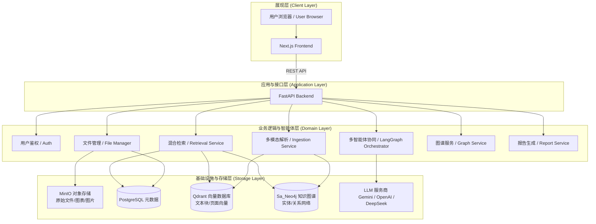
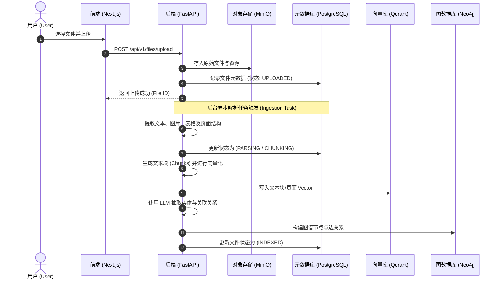
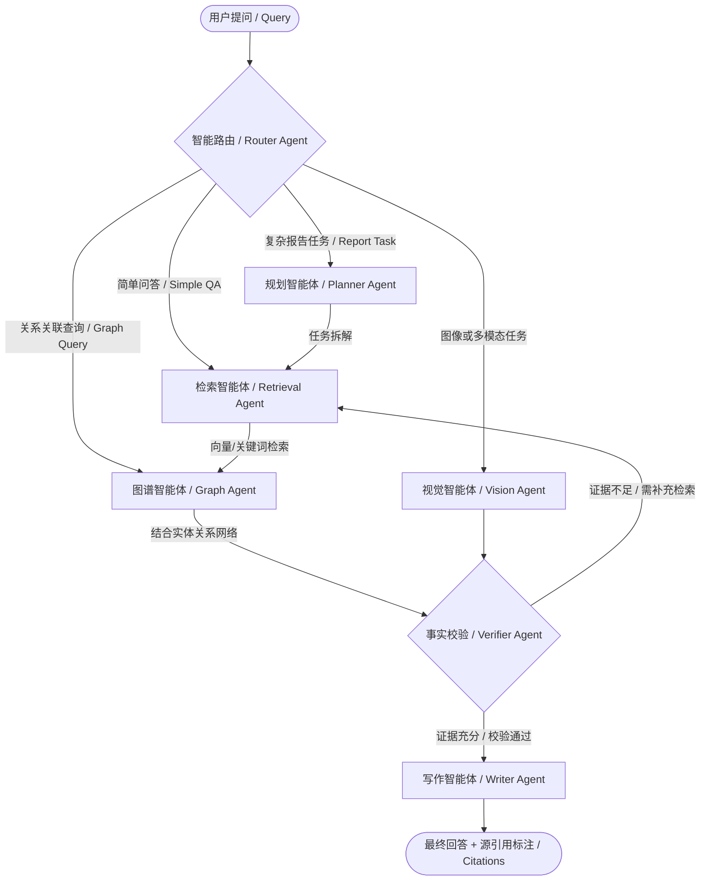

# InsightGraph Agent (多模态知识图谱智能体系统)

InsightGraph Agent 是一个生产级别的**多模态文件管理 + 混合检索 RAG + 知识图谱 GraphRAG + 多智能体协同 (Multi-Agent Workflow)** 的知识工作台。系统能自动解析用户上传的多种格式文档，构建多模态向量索引与知识图谱，并借助 AI 智能体完成多步规划、推理、证据核验，最终生成带有源引用的准确回答与结构化报告。

---

## 🗺️ 系统架构图 (System Architecture)

系统基于分层设计架构构建，涵盖展现层、应用层、业务逻辑层以及底层的多模态数据存储层。



---

## 🔄 业务流程图 (Business Workflow)

系统的核心业务逻辑分为两大主要数据流：**多模态文档解析入库流程** 与 **智能体多阶段问答推理流程**。

### 1. 多模态文档解析入库流程 (Document Ingestion Flow)

当用户在前端上传文档时，系统在后台采用异步/后台任务进行多模态拆解、提取向量和构建图谱：



### 2. 智能体多阶段问答推理流程 (Agentic Query Flow)

当用户提出复杂的跨文档问题时，系统不会直接调用 RAG，而是通过基于 LangGraph 编排的 Multi-Agent Workflow 进行动态规划、检索和自我验证：



---

## 🚀 核心功能 (Features)

*   📁 **多模态文件管理**：统一上传并管理 PDF、Word、PowerPoint、文本和 Markdown 文件。
*   ⚙️ **异步提取与解析**：自动剥离文档中的文本、表格与插图，支持多模态解析及 OCR。
*   🔍 **混合检索 (Hybrid RAG)**：结合 BM25 关键词检索、Qdrant 向量检索与多维 Metadata 过滤，并引入 Reranker 重排序以提升检索精度。
*   🌐 **图谱检索 (GraphRAG)**：后台自动提取实体和关系写入 Neo4j，利用图谱在问答中进行深度关联推理。
*   🤖 **LangGraph 智能体编排**：由 Planner、Retriever、Graph Agent、Verifier、Writer 组成的的多 Agent 系统，提供实时推理轨迹（Execution Trace）可视化。
*   📊 **全自动报告生成**：根据用户给定的主题，Agent 会自主检索整个知识库，起草并生成结构化的 Markdown 报告。

---

## 🛠️ 技术栈 (Tech Stack)

| 模块 | 技术选型 | 备注说明 |
| :--- | :--- | :--- |
| **前端 (Frontend)** | Next.js 16 (React 19), TypeScript, Tailwind CSS, shadcn/ui | 现代响应式 UI，实时执行流追踪展示 |
| **后端 (Backend)** | FastAPI, Pydantic, SQLModel, SQLAlchemy | 异步高性能 REST API |
| **AI 编排** | LangGraph, LangChain | 多 Agent 状态管理及工作流控制 |
| **元数据存储** | PostgreSQL | 存储用户、文件元数据、文档块结构及日志 |
| **向量检索** | Qdrant | 存储文档块的向量 Embedding 并提供相似度检索 |
| **知识图谱** | Neo4j | 存储并查询实体与关系网络 |
| **对象存储** | MinIO | 存储原始文档、解析的图片和网页缩略图 |
| **缓存与队列** | Redis | 异步任务调度与系统缓存 |

---

## 📦 快速入门 (Getting Started)

### 1. 准备环境配置文件

在项目根目录下，将配置文件模板 `.env.example` 复制一份并命名为 `.env`：

```bash
cp .env.example .env
```

编辑 `.env` 文件，填入您的 AI 接口密钥（如 `DEEPSEEK_API_KEY` 或 `GOOGLE_API_KEY` 等）。

---

### 2. 启动服务 (两种方式)

> [!IMPORTANT]
> **WSL 与 Windows 本地混合开发网络说明**：
> 如果您在 **WSL** 环境中运行 Docker 服务（数据库），但在 **Windows** 上直接运行 Python 后端，Windows 上的后端将无法通过 `localhost` 访问 WSL 内部的数据库。
> 
> **解决方案**：
> 1. 在 WSL 中运行 `hostname -I` 获取 WSL 虚拟机的 IP 地址（例如 `172.22.105.254`）。
> 2. 将 Windows 本地 `.env` 中的 `localhost` 全部替换为该 WSL IP，例如：
>    ```env
>    DATABASE_URL=postgresql+asyncpg://postgres:postgres@<WSL_IP>:5432/insightgraph
>    QDRANT_HOST=<WSL_IP>
>    NEO4J_URI=bolt://<WSL_IP>:7687
>    MINIO_ENDPOINT=<WSL_IP>:9000
>    REDIS_URL=redis://<WSL_IP>:6379/0
>    ```

#### 方式 A：使用 Docker Compose 一键整体启动（推荐）

如果您的开发环境中已安装并启用了 Docker，可以直接一键部署全部服务：

```bash
docker compose up -d
```
*   **前端访问地址**：`http://localhost:3000`
*   **后端 API 文档**：`http://localhost:8000/api/v1/docs`

#### 方式 B：本地分步开发启动

如果您想单独调试前端或后端，可以分步启动：

##### 步骤一：仅在 Docker/WSL 中运行依赖数据库
```bash
# 启动 PostgreSQL, Qdrant, Neo4j, MinIO, Redis
docker compose up -d postgres qdrant neo4j minio redis
```

##### 步骤二：启动后端 (Backend)
进入 `backend` 目录，安装依赖并运行：
```bash
cd backend
python -m venv .venv
source .venv/bin/activate  # Windows 下使用: .venv\Scripts\activate
pip install -r requirements.txt
python -m app.main
```

##### 步骤三：启动前端 (Frontend)
进入 `frontend` 目录，安装依赖并开发启动：
```bash
cd frontend
npm install
npm run dev
```

---

## 📖 核心 API 示例

### 1. 上传文档
```bash
curl -X POST http://localhost:8000/api/v1/files/upload \
  -F "file=@/path/to/your/document.pdf"
```

### 2. 知识检索与智能体问答
```bash
curl -X POST "http://localhost:8000/api/v1/agent/runs?query=Compare+RAG+designs"
```

---

## 🗺️ 项目开发状态

详情请参阅 [PROJECT_STATUS.md](./PROJECT_STATUS.md) 查看系统各个模块的当前开发进度与未来规划。

---

## 📄 开源协议
本项目采用 [MIT License](./LICENSE) 许可。
